# Chapter 3: Methodology

---

## 3.1 Introduction

This chapter presents the methodology employed in the design and development of **Campus Connect**, a comprehensive campus management mobile application developed using the Flutter framework. The system integrates five primary functional modules—Lost and Found Management, Issue Management, Locker Management, Event Management, and an administrative panel—into a unified platform accessible to students and administrators of a higher education institution.

The system follows a component-based, service-oriented architecture wherein a central data service (`DataService`) manages all application state and business logic, whilst a reactive UI layer built upon the Provider pattern reflects real-time data changes across all screens. Authentication and session persistence are handled by a dedicated `AuthService` component using local device storage.

All data interactions in the current prototype are managed through an in-memory data layer (`DataService` backed by `MockData`), simulating the behaviour of a live backend system. This approach was chosen to facilitate rapid prototyping and user testing prior to the integration of a persistent database layer such as Firebase Firestore.

---

## 3.2 System Architecture

### 3.2.1 Overall Architecture

The Campus Connect system is structured around a three-layer architecture:

1. **Presentation Layer** — Flutter widget tree comprising screens, reusable widgets, and navigation routing via GoRouter.
2. **Business Logic Layer** — `DataService` (ChangeNotifier) containing all state management, data manipulation methods, and notification dispatch.
3. **Data Layer** — `MockData` class providing structured in-memory seed data across all modules.

Authentication is handled independently by `AuthService`, which persists user credentials locally using `SharedPreferences`, enabling session restoration on subsequent application launches.

### 3.2.2 System Architecture Diagram

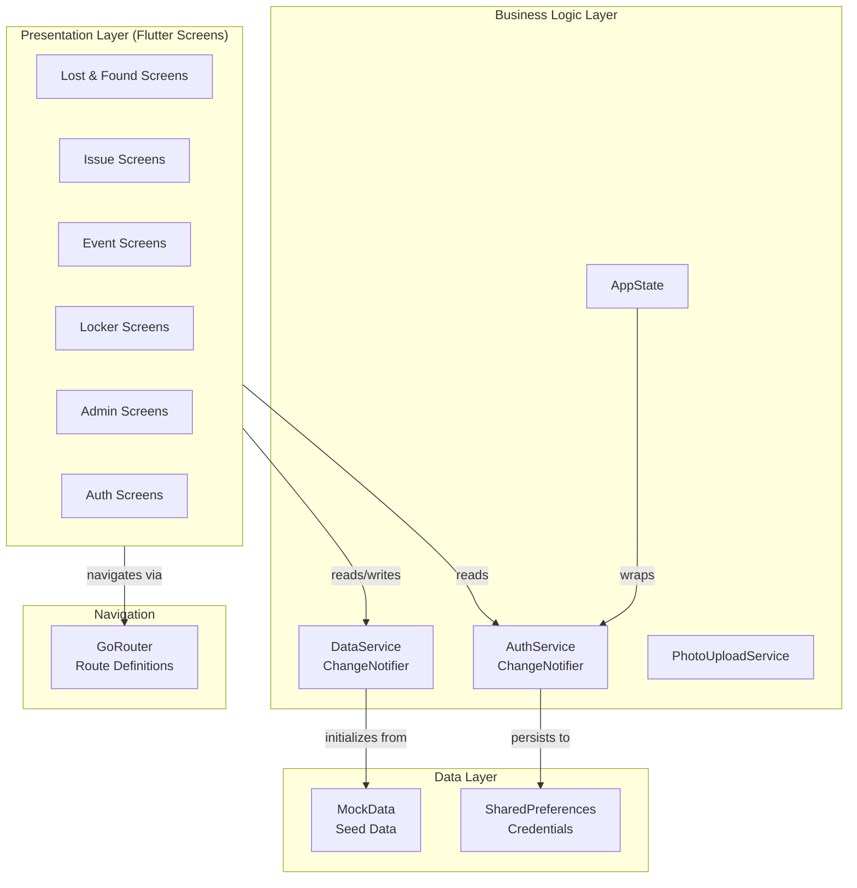

### 3.2.3 State Management Architecture

The application employs the **Provider** pattern for reactive state management. Both `DataService` and `AppState` extend `ChangeNotifier`, and consumer widgets (`Consumer`, `Consumer2`) subscribe to state changes and rebuild automatically when `notifyListeners()` is invoked. This ensures that any data mutation—such as an admin approving an event—is immediately reflected across all screens that reference that data.

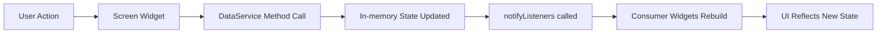

---

## 3.3 Technology Stack

| Component | Technology |
|---|---|
| Mobile Framework | Flutter 3.x (Dart) |
| State Management | Provider (`ChangeNotifier`) |
| Navigation | GoRouter |
| Local Storage | `shared_preferences` |
| QR Code Generation | `qr_flutter` |
| File Selection | `file_picker` |
| UI Animation | `flutter_animate` |
| UI Theme | Custom `AppTheme` (Material 3) |
| Data Layer | In-memory (`MockData` + `DataService`) |

---

## 3.4 Development Approach

The development followed an iterative, feature-driven approach whereby each functional module was designed, implemented, and tested independently before integration into the unified application shell. The application shell (`AppShell`) provides a persistent bottom navigation bar enabling seamless traversal between the four primary student-facing modules (Lost & Found, Issues, Events, Lockers).

Role-based access control is enforced at the navigation and UI level: authenticated students see the student-facing screens, whilst administrators are routed to admin-specific screens through a separate navigation path. Both roles share the same application binary and data service, with visibility filtered dynamically based on the authenticated user's role.

---

## 3.5 Authentication and User Management

### 3.5.1 Module Description

The Authentication module governs user identity, session management, and account provisioning. The system supports two distinct user roles: **Student** and **Administrator**. Each role is associated with a separate set of credentials and profile information.

### 3.5.2 User Roles

| Role | Access Level | Identifier Format |
|---|---|---|
| Student | Own data + public events/issues | `S001`, `S002`, `S003`, … |
| Administrator | All modules, all records, full CRUD | `ADMIN001`, `ADMIN002` |

### 3.5.3 Authentication Workflow

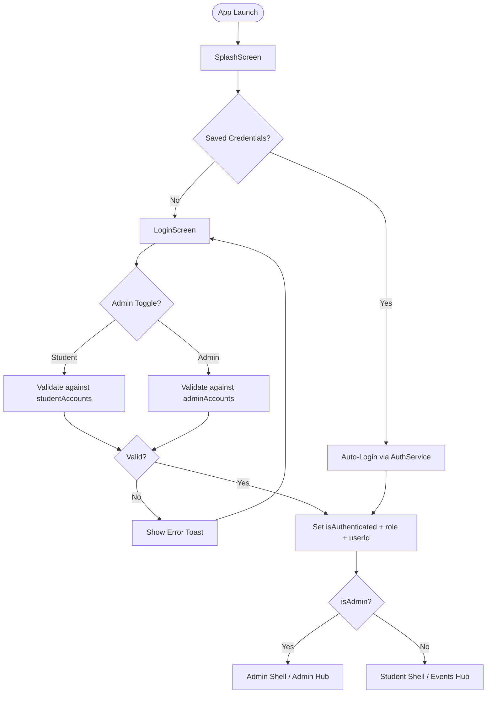

### 3.5.4 Session Persistence

When a user selects "Remember Me" on the login screen, the system invokes `AuthService.saveCredentials()`, which stores the user ID and password in `SharedPreferences`. On the next launch, `SplashScreen` calls `loadSavedCredentials()` and automatically re-authenticates the user without requiring manual login.

### 3.5.5 Student Registration Flow

New students may register through the `RegistrationScreen`. Registrations are submitted as `StudentRegistration` objects with a status of `Pending` and added to `DataService.pendingRegistrations`. An administrator reviews these registrations through the Admin Registrations screen, and upon approval, calls `AuthService.addApprovedStudent()`, which adds the new account to the live `_studentAccounts` map and persists the profile.

---

## 3.6 Module 1: Lost and Found Management

### 3.6.1 Module Description

The Lost and Found Management module provides a structured digital mechanism for students to report lost items and found items on campus. The system incorporates an AI-simulated matching engine that cross-references lost and found reports based on category, location, and description, producing a match confidence score. Physical handover of found items is tracked through a five-step QR-code-based handover process, ensuring accountability at each stage.

### 3.6.2 Data Models

| Model | Key Attributes |
|---|---|
| `LostReport` | `id`, `title`, `category`, `whereLost`, `whenLost`, `status`, `description`, `photos`, `matchStatus` |
| `FoundReport` | `id`, `description`, `category`, `whereFound`, `whenFound`, `status`, `handoverStatus`, `qrCode`, `qrScanned`, `handoverStep` |
| `AdminLostReport` | `id`, `studentId`, `title`, `category`, `whereLost`, `status`, `createdDate`, `aiScore`, `matchedFoundId` |
| `LfMatch` | `id`, `lostId`, `foundId`, `score`, `status`, `notes` |

### 3.6.3 Lost Item Report Status Lifecycle

| Status | Description |
|---|---|
| `Active` | Report submitted, awaiting match |
| `Matched - Pending` | AI match found; pending confirmation |
| `Closed` | Item recovered or case closed |

### 3.6.4 Found Item Handover Steps

The handover of a found item follows a five-step process tracked by the `handoverStep` field:

| Step | Description |
|---|---|
| 1 | Found item reported by student |
| 2 | Item received and logged by admin at the Lost & Found office |
| 3 | Admin generates a one-time QR code (`RCV-{id}-{random}`) for the claimant |
| 4 | QR code is shared with the reporting student for handover verification |
| 5 | Student scans QR code; handover confirmed; status set to `Handed Over` |

### 3.6.5 System Flowchart — Lost and Found

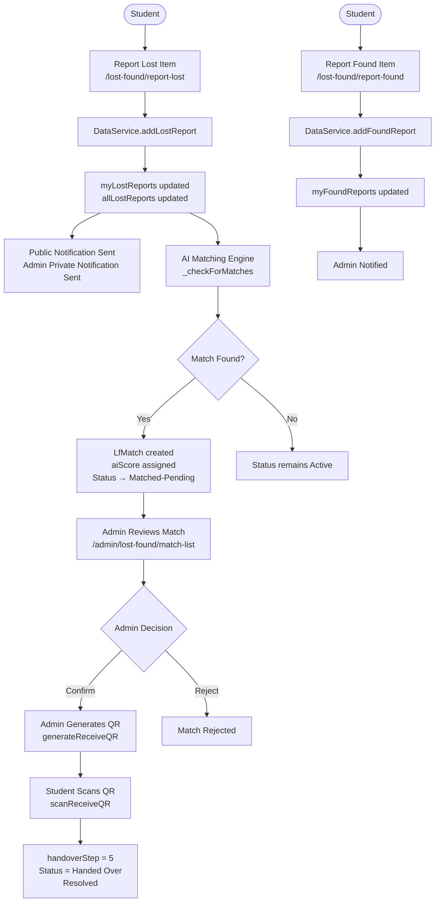

### 3.6.6 Role-Based Behaviour

| Feature | Student | Administrator |
|---|---|---|
| Report lost item | ✅ Own reports only | ✅ View all reports |
| Report found item | ✅ Own reports only | ✅ View all found items |
| View AI match score | ❌ | ✅ |
| Confirm/reject match | ❌ | ✅ |
| Generate handover QR | ❌ | ✅ |
| Scan handover QR | ✅ | ❌ |
| Update report status | ❌ | ✅ |

### 3.6.7 AI Matching Engine

Upon submission of a found report, `DataService._checkForMatches()` is invoked. The engine computes a similarity score (`aiScore`) between the newly submitted found item and all active lost reports, evaluating attributes such as category, location proximity, and descriptive similarity. Matches with a score exceeding a defined threshold are automatically assigned `Matched - Pending` status and surfaced to administrators for manual confirmation.

---

## 3.7 Module 2: Issue Management

### 3.7.1 Module Description

The Issue Management module enables students to report campus infrastructure problems, IT failures, safety hazards, and cleanliness concerns directly through the application. Each report is routed to the administrative team, which manages its resolution through a clearly defined status progression. A full audit trail of status transitions is maintained via an `IssueHistory` log.

### 3.7.2 Data Models

| Model | Key Attributes |
|---|---|
| `Issue` | `id`, `title`, `category`, `location`, `status`, `createdDate`, `updatedDate`, `description`, `studentId`, `imagePaths` |
| `IssueHistory` | `date`, `from` (previous status), `to` (new status), `note` |

### 3.7.3 Issue Categories

- Facilities (air conditioning, projectors, furniture)
- IT (Wi-Fi, computers, network infrastructure)
- Safety (waterlogging, fire hazards, structural issues)
- Cleanliness (washrooms, corridors, common areas)

### 3.7.4 Issue Status Workflow

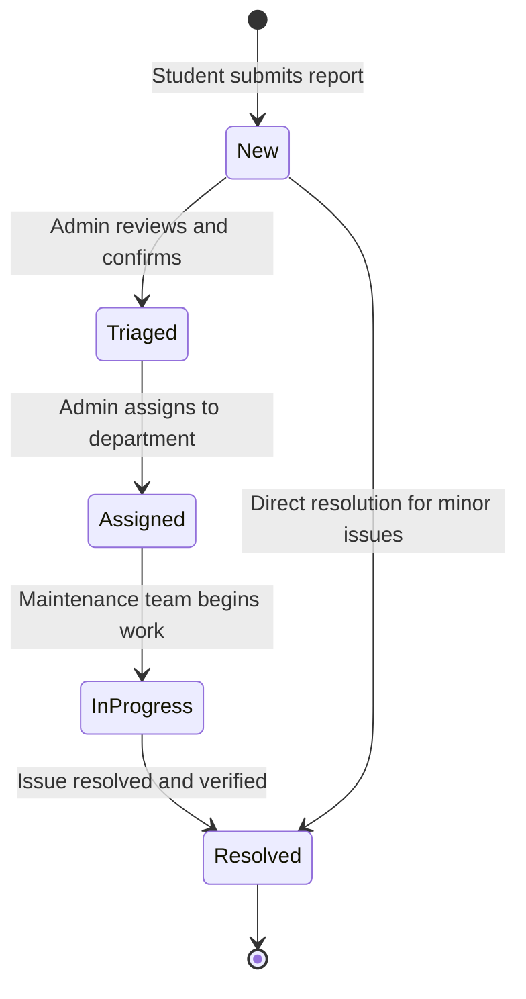

### 3.7.5 System Flowchart — Issue Management

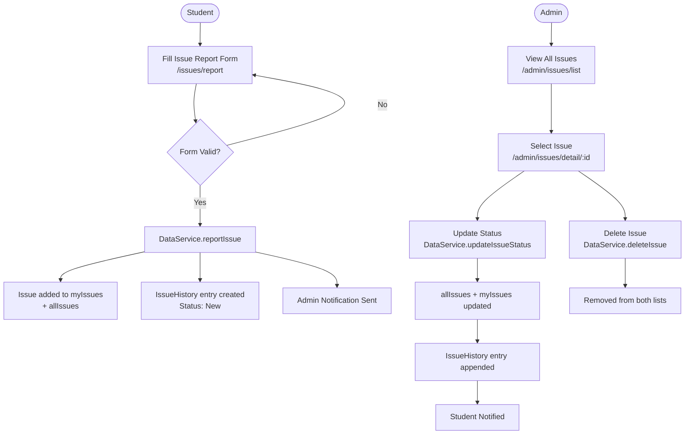

### 3.7.6 Data Synchronisation

A key design consideration is the synchronisation between the student-visible `myIssues` list and the admin-visible `allIssues` list. When an administrator updates an issue status via `updateIssueStatus()`, the service updates both lists simultaneously, ensuring that the student immediately sees the updated status upon their next view of the issue without any additional round-trip.

### 3.7.7 Role-Based Behaviour

| Feature | Student | Administrator |
|---|---|---|
| Submit issue report | ✅ | ❌ |
| View own issues | ✅ | — |
| View all campus issues | ❌ | ✅ |
| Update issue status | ❌ | ✅ |
| Delete issue | ❌ | ✅ |
| View issue history log | ✅ (own) | ✅ (all) |
| Photo attachments | ✅ | ✅ (view only) |

---

## 3.8 Module 3: Locker Management

### 3.8.1 Module Description

The Locker Management module facilitates the self-service booking and lifecycle management of campus lockers by students. The system supports two locker types—key-based and digital-code-based—and enforces a one-locker-per-student policy. Financial transactions including deposits and monthly rental payments are recorded within the system, and a QR-code-based key collection and return process ensures physical key accountability.

### 3.8.2 Data Models

| Model | Key Attributes |
|---|---|
| `Locker` | `id`, `location`, `status`, `studentId`, `startDate`, `endDate`, `daysLeft`, `lockType`, `digitalCode`, `monthlyRent`, `deposit`, `depositRefunded` |
| `LockerBooking` | `id`, `lockerId`, `location`, `startDate`, `endDate`, `status`, `daysLeft`, `durationMonths`, `monthlyRent`, `deposit`, `totalPaid`, `keyCollectionQR`, `keyCollected`, `keyReturnQR`, `keyReturned`, `releaseStatus` |
| `LockerIssue` | `id`, `lockerId`, `studentId`, `description`, `status`, `photoCount`, `reportedDate` |
| `LockerHistory` | `action`, `staffId`, `timestamp`, `reason` |

### 3.8.3 Locker Status Values

| Status | Description |
|---|---|
| `Available` | Ready for booking |
| `Pending Pickup` | Booked but key not yet collected |
| `Active` | In use by a student |
| `Overdue` | Rental period expired, not released |
| `Blocked` | Administratively locked (maintenance, penalty) |

### 3.8.4 Pricing Structure

| Component | Amount |
|---|---|
| Monthly Rent | RM 10.00 |
| Refundable Deposit | RM 100.00 |
| Initial Payment (deposit + first month) | RM 110.00 |
| Rental Extension | RM 10.00 per additional month |

### 3.8.5 System Flowchart — Locker Booking

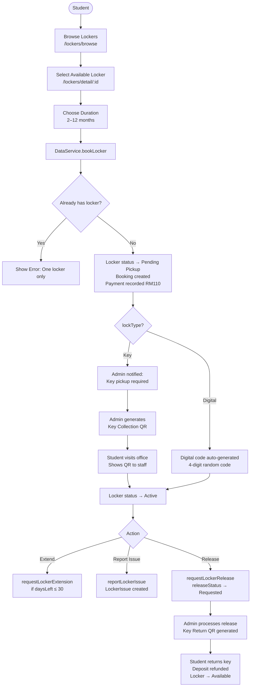

### 3.8.6 Key Collection and Return Process

For key-type lockers, physical key handover is governed by a QR-code exchange protocol:

1. **Collection**: After booking, the student visits the locker administration office. An administrator generates a one-time `keyCollectionQR` code. The student scans this QR in the app to confirm key receipt, and the locker status transitions to `Active`.
2. **Return**: When the student initiates a release request, the administrator generates a `keyReturnQR` code. The student scans this to confirm key return. The system then records the return date, refunds the deposit, and marks the locker as `Available`.

### 3.8.7 Role-Based Behaviour

| Feature | Student | Administrator |
|---|---|---|
| Browse available lockers | ✅ | ✅ |
| Book a locker | ✅ (1 max) | ❌ |
| View own booking details | ✅ | — |
| Extend rental period | ✅ (if ≤ 30 days left) | ❌ |
| Report locker issue | ✅ | — |
| Release locker | ✅ (request) | ✅ (execute) |
| Generate collection/return QR | ❌ | ✅ |
| Update locker status (block/terminate) | ❌ | ✅ |
| View full locker history log | ❌ | ✅ |

---

## 3.9 Module 4: Event Management

### 3.9.1 Module Description

The Event Management module enables students to browse, join, and organise campus events, whilst providing administrators with a comprehensive event approval and publishing workflow. The module supports four distinct event participation types and includes a QR-code-based ticketing system. Student event creators have access to a dedicated four-tab management dashboard (`ManageMyEventScreen`) for handling participant registration, team roles, and on-site entry verification.

### 3.9.2 Data Models

| Model | Key Attributes |
|---|---|
| `Event` | `id`, `title`, `date`, `time`, `location`, `category`, `organizer`, `description`, `status`, `hostStudentId`, `approvalLetterPath`, `rejectionReason`, `revisionNotes`, `messages`, `revisionCount`, `eventType`, `isPrivate`, `isPaid`, `price`, `attendeeIds`, `pendingJoiningIds` |
| `EventJoining` | `id`, `eventId`, `studentId`, `name`, `courseName`, `clubId`, `status`, `paymentStatus`, `qrTicketCode`, `joinedDate`, `hasAttended` |
| `EventRole` | `id`, `eventId`, `studentId`, `studentName`, `role`, `permissions` |
| `EventMessage` | `id`, `senderId`, `senderRole`, `message`, `timestamp`, `attachmentName` |

### 3.9.3 Event Types

| Event Type | `isPrivate` | `isPaid` | Registration Method |
|---|---|---|---|
| Open | False | False | Quick Join (instant) |
| Club | True | False | Request + Admin Approval |
| Club + Payment | True | True | Request + Approval + Payment |
| Paid | False | True | Request + Payment |

### 3.9.4 Event Approval Lifecycle

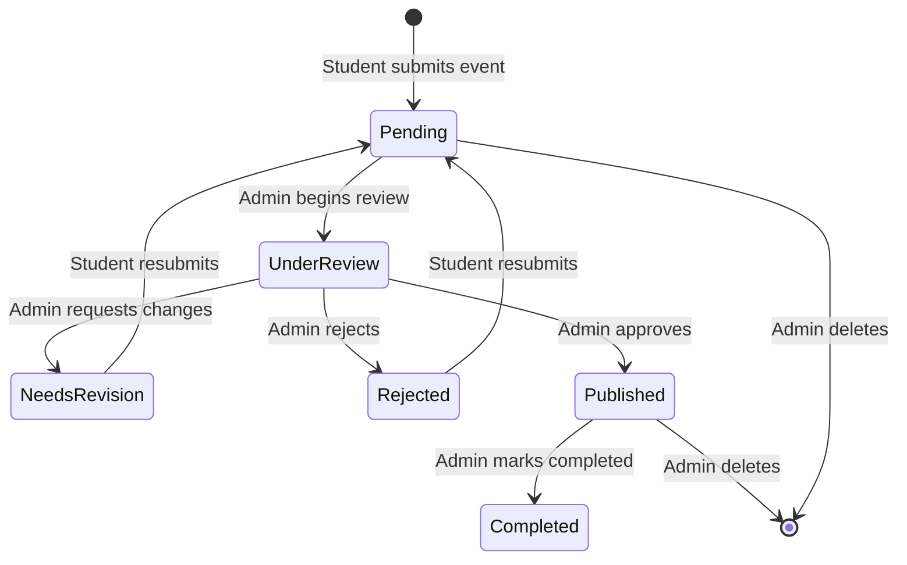

### 3.9.5 System Flowchart — Event Creation and Approval

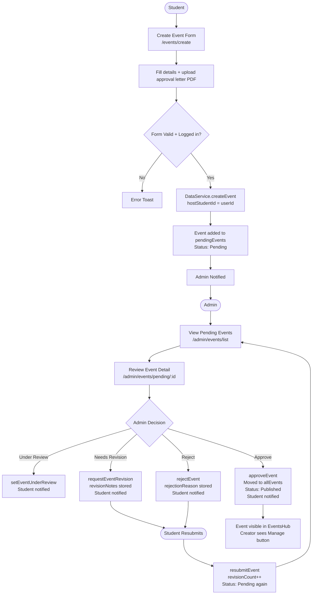

### 3.9.6 Event Joining Workflow

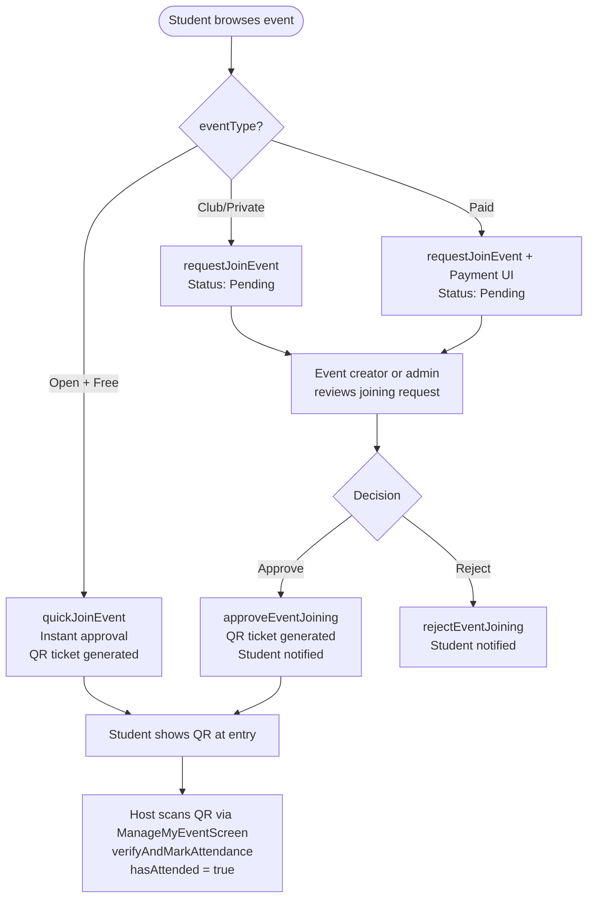

### 3.9.7 Creator Management Dashboard (ManageMyEventScreen)

The `ManageMyEventScreen` (`/events/manage/:id`) is a four-tab dashboard available exclusively to the event creator (`hostStudentId == userId`) and team members with appropriate roles.

| Tab | Contents |
|---|---|
| **Overview** | Event banner, live statistics (Registered / Pending / Attended), admin message thread, edit event details |
| **Participants** | Filterable list (All / Pending / Approved / Rejected), approve/reject joining requests, payment status, QR ticket preview |
| **Roles** | Assign `Organizer`, `Staff`, or `Volunteer` roles to team members with granular permissions (`scan_qr`, `manage_participants`, `edit_event`) |
| **Entry / QR** | QR camera scanner for attendee verification, check-in progress bar, list of checked-in participants, manual toggle |

### 3.9.8 Role-Based Behaviour

| Feature | Student | Event Creator | Administrator |
|---|---|---|---|
| Browse events | ✅ | ✅ | ✅ |
| Join event | ✅ | — | ❌ |
| Create event | ✅ | — | ✅ (direct) |
| View approval status | — | ✅ (own) | ✅ (all) |
| Approve/reject event | ❌ | ❌ | ✅ |
| Manage participants | ❌ | ✅ | ✅ |
| Assign team roles | ❌ | ✅ | ❌ |
| Scan entry QR | ❌ | ✅ | ✅ |
| Delete/complete event | ❌ | ❌ | ✅ |
| Send event notices | ❌ | ❌ | ✅ |

---

## 3.10 Admin Panel

### 3.10.1 Overview

The Admin Panel is a role-protected administrative interface accessible exclusively to users authenticated with an admin account. It provides centralised governance across all five system modules, with dedicated screens for each domain of responsibility. Administrators are routed directly to an admin-specific dashboard upon login, which differs from the student-facing application shell.

The admin panel does not utilise a separate bottom navigation bar. Instead, each module's admin entry point is accessed via dedicated routes prefixed with `/admin/`, and the panel provides a cross-module overview of pending tasks requiring attention.

### 3.10.2 Admin Panel Architecture

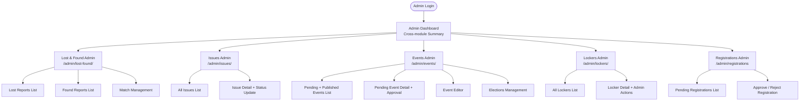

### 3.10.3 Admin Workflow — Lost and Found

The administrator accesses `/admin/lost-found/lost-list` and `/admin/lost-found/found-list` to view all reports submitted by all students. For each identified match (surfaced by the AI matching engine), the admin navigates to `/admin/lost-found/match/:id` to review match details, confirm or reject the pairing, and initiate the handover process.

**Key admin actions:**
- Update lost/found report statuses (`updateAdminLostReportStatus`, `updateFoundReportStatus`)
- Generate one-time QR codes for item handover (`generateReceiveQR`, `generateHandoverQR`)
- Confirm item claim completion (`completeHandover`)

### 3.10.4 Admin Workflow — Issue Management

All campus issues submitted by students are visible at `/admin/issues/list`, filterable by status. Upon selecting an issue at `/admin/issues/detail/:id`, the administrator may:

1. Advance the issue through the status pipeline: `New → Triaged → Assigned → In Progress → Resolved`
2. Add a contextual note to the history log during each status transition
3. Delete resolved or duplicate issues (`deleteIssue`)

The status update simultaneously propagates to the student's `myIssues` list, ensuring the student always sees the current resolution state.

### 3.10.5 Admin Workflow — Event Management

```mermaid
flowchart TD
    A[Admin views /admin/events/list] --> B{List Tabs}
    B -- Pending --> C[Pending Events]
    B -- Published --> D[Published/Completed Events]
    C --> E[Quick Actions on List Card]
    E --> F[Quick Approve\napproveEvent]
    E --> G[Quick Reject\nrejectEvent with reason]
    C --> H[Detailed Review\n/admin/events/pending/:id]
    H --> I[Read approval letter PDF]
    H --> J[Read admin–student message thread]
    H --> K{Full Decision}
    K --> L[Set Under Review]
    K --> M[Request Revision + notes]
    K --> N[Reject + reason]
    K --> O[Approve → Published]
    D --> P[/admin/events/editor/:id\nEdit published event]
    D --> Q[Mark Completed]
    D --> R[Send Notice to creator]
    D --> S[Delete Event]
```

### 3.10.6 Admin Workflow — Locker Management

The administrator accesses `/admin/lockers/list` to view all lockers with their current status, assigned student, and remaining days. From the detail screen `/admin/lockers/detail/:id`, the following actions are available:

| Admin Action | Method | Outcome |
|---|---|---|
| Activate locker (key collected) | `updateLockerStatus('Active')` | Locker is activated for student use |
| Generate key collection QR | Admin UI + booking update | Student can collect key |
| Generate key return QR | Admin UI + booking update | Student can return key |
| Terminate agreement | `terminateLocker()` | Booking deleted, deposit forfeited, locker freed |
| Block locker | `blockLocker()` | Locker unavailable, no active booking |
| Update any status | `updateLockerStatus()` | Flexible status override |
| View complete history | `lockerHistory[lockerId]` | Full audit trail displayed |

### 3.10.7 Admin Workflow — Student Registration

Pending student registration requests are displayed at `/admin/registrations`. Each entry shows the student ID, name, email, faculty, and submission date. The administrator may:

- **Approve**: Calls `AuthService.addApprovedStudent()`, which adds the student account to the live authentication registry and persists the profile to `SharedPreferences`. The registration record is removed from the pending queue.
- **Reject**: Removes the registration from the pending list without account creation.

### 3.10.8 Admin Access Control

All admin-only routes are protected at the UI level by checking `appState.isAdmin` before rendering admin-specific content. Attempting to navigate to admin routes while authenticated as a student results in the user being redirected to the standard student view. The following table summarises admin-exclusive capabilities:

| Capability | Admin |
|---|---|
| View all students' reports and issues | ✅ |
| Approve / reject event submissions | ✅ |
| Directly create and publish events (bypassing approval) | ✅ |
| Manage locker lifecycle (activate, block, terminate) | ✅ |
| Generate and validate handover QR codes | ✅ |
| Approve / reject student registrations | ✅ |
| Send event notices to student creators | ✅ |
| Manage elections content and candidates | ✅ |
| Delete any record from any module | ✅ |

---

## 3.11 Notification System

### 3.11.1 Description

The notification system provides real-time in-app alerts generated by each module's business logic. Notifications are classified by type, visibility, source module, and target user, enabling precise delivery of information to the appropriate audience.

### 3.11.2 Notification Attributes

| Attribute | Values | Purpose |
|---|---|---|
| `type` | `public`, `private`, `personal` | Determines audience |
| `visibility` | `all`, `student`, `admin` | Role-level filtering |
| `targetUserId` | Student ID or null | User-specific delivery |
| `source` | `lost_found`, `events`, `lockers`, `issues`, `system` | Module tagging |
| `relatedScreen` | Screen route identifier | Deep-link navigation |
| `read` | boolean | Read/unread state |

### 3.11.3 Notification Dispatch Model

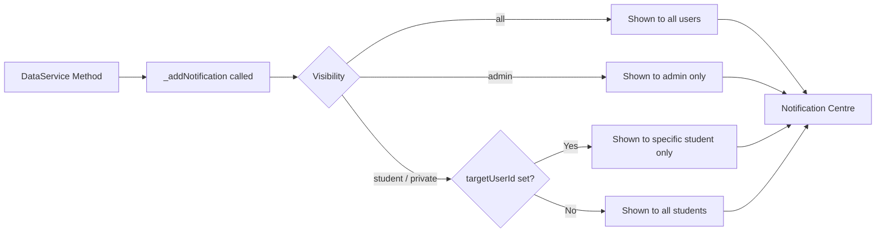

### 3.11.4 Notification Triggers by Module

| Module | Trigger Event | Audience |
|---|---|---|
| Lost & Found | New lost report submitted | Admin (private) + All (public) |
| Lost & Found | New found report submitted | Admin (private) + All (public) |
| Lost & Found | Handover QR generated | Admin |
| Lost & Found | Handover confirmed | Student (specific) |
| Issues | New issue reported | Admin |
| Issues | Issue status updated | Student (specific) |
| Events | New event submitted | Admin (private) + All (public) |
| Events | Event approved | Student creator (specific) |
| Events | Event rejected / revision requested | Student creator (specific) |
| Events | Joining request received | Admin |
| Events | Joining approved/rejected | Student applicant (specific) |
| Lockers | Locker booked | Student (specific) + Admin |
| Lockers | Issue reported | Admin + Student (specific) |
| Lockers | Locker terminated/blocked | Student (specific) |

---

## 3.12 Data Management

### 3.12.1 Data Architecture

In the current prototype, all application data is managed in-memory by the `DataService` class. At application startup, `DataService._initializeData()` populates mutable list copies from `MockData`, which serves as the static seed data source. All data mutations operate exclusively on these in-memory lists, and `notifyListeners()` is called after each mutation to propagate changes to the UI.

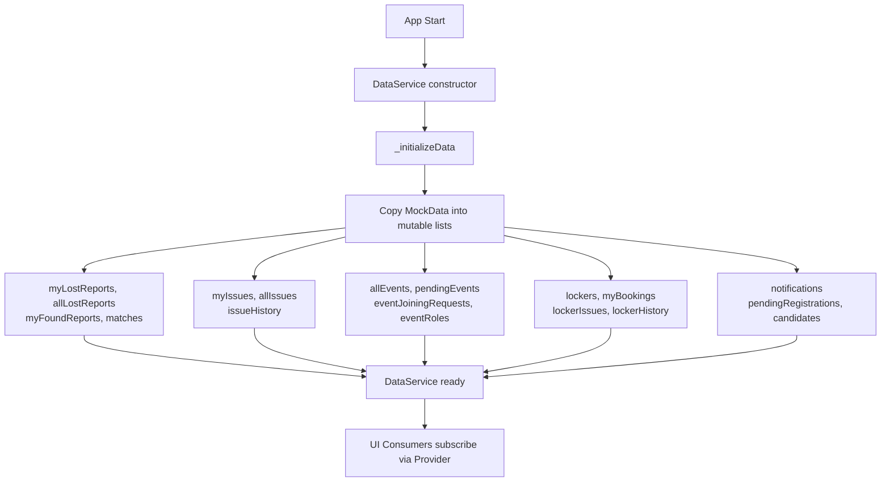

### 3.12.2 Data Entities and Relationships

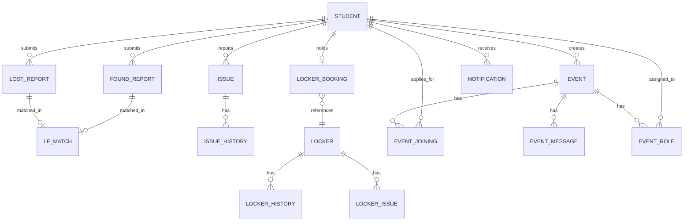

### 3.12.3 Persistence Boundary

The current implementation maintains data exclusively in RAM. The following components are the only data that survive application restarts:

| Persisted Data | Mechanism |
|---|---|
| User login credentials (if "Remember Me") | `SharedPreferences` |
| User profile overrides (name, email, etc.) | `SharedPreferences` (JSON) |
| Approved student accounts | `SharedPreferences` (via `AuthService`) |

All event submissions, locker bookings, lost/found reports, and issues are currently session-scoped and will be reset upon application restart. Migration to a persistent backend (Firebase Firestore or equivalent) is planned for the subsequent development phase.

---

## 3.13 System Workflow Diagrams

### 3.13.1 Complete Student Journey

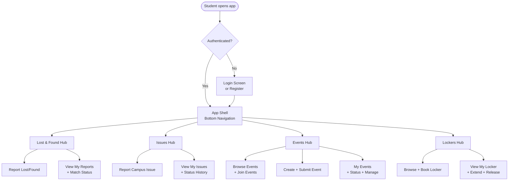

### 3.13.2 Complete Admin Workflow

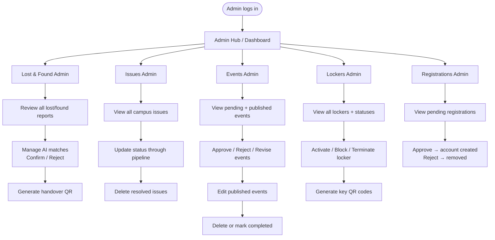

---

## 3.14 Security and Access Control

### 3.14.1 Role Enforcement

The system enforces role-based access control (RBAC) at two levels:

1. **Route level**: Admin-prefixed routes (`/admin/*`) are only rendered when `appState.isAdmin` is `true`. Students navigating to these routes are redirected to the standard application shell.
2. **UI level**: Action buttons, edit controls, and sensitive data fields are conditionally rendered based on `appState.isAdmin` or the ownership relationship (e.g., `event.hostStudentId == appState.userId`).

### 3.14.2 File Access Control

The `DataService.canAccessFilePath()` method implements a permission check for sensitive document access (e.g., event approval letters):

- **Admins**: Unconditional access to all files.
- **Event creator**: Access only to files associated with their own events (`userId == eventCreatorId`).
- **Other students**: Access denied.

### 3.14.3 Event Action Permissions

The `DataService.canPerformAction()` method governs access to event management operations:

- **Event creator** (`hostStudentId == userId`): Full access to all management actions.
- **Assigned team members** (`EventRole`): Access limited to the permissions listed in their role (`scan_qr`, `manage_participants`, `edit_event`).
- **Others**: No management access.

---

## 3.15 Summary

This chapter presented a comprehensive methodology for the Campus Connect system, a multi-module Flutter mobile application designed to digitise and streamline core campus service operations. The system's architecture, built upon the Provider state management pattern and GoRouter navigation, enables a reactive and role-aware user experience across five integrated modules.

The Lost and Found module introduces AI-assisted item matching and QR-code-based handover accountability. The Issue Management module provides a transparent, audited status pipeline from report submission to resolution. The Locker Management module implements a complete self-service rental lifecycle with financial tracking and physical key management protocols. The Event Management module supports a multi-type event creation, administrative approval workflow, and a dedicated creator management dashboard with QR-based attendance verification. The Admin Panel centralises oversight of all modules under a unified, permission-gated interface.

The notification system ensures timely communication between the system and its users, whilst the service-layer architecture cleanly separates business logic from presentation concerns, facilitating future migration to a persistent cloud backend without significant UI changes.
